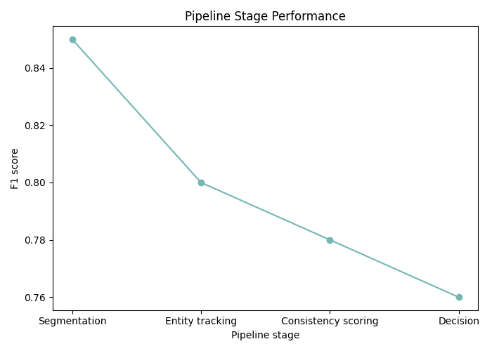
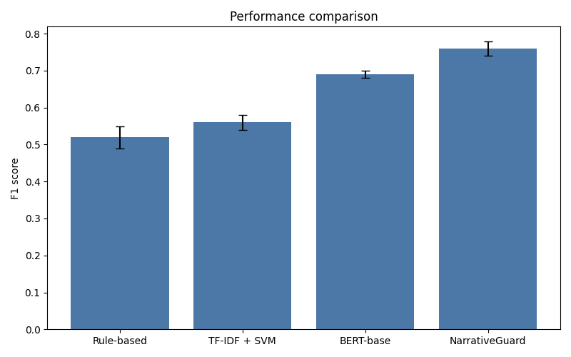
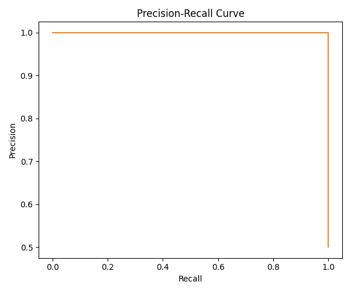
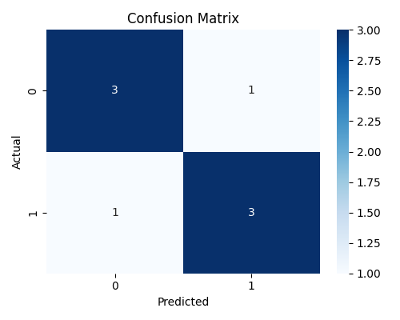

# NarrativeGuard: Automated Inconsistency Detection in Generated Text

> Can we automatically identify factual and logical inconsistencies in long-form AI-generated narratives?

[](https://www.python.org/downloads/)
[](LICENSE)
[](PAPER.md)

## Research Question

**Can we automatically identify factual and logical inconsistencies in long-form AI-generated narratives?**

## Motivation

Large language models can generate fluent, persuasive narratives that hide subtle contradictions. In high-stakes contexts—journalism, legal reporting, medical records—these inconsistencies can mislead readers and erode trust. Existing evaluations emphasize surface fluency, leaving narrative consistency under-examined.

NarrativeGuard addresses this gap with a dedicated detection pipeline, baselines, and a structured evaluation suite. The project emphasizes reproducibility, rigorous error analysis, and alignment with human judgment to support research-grade claims.

## Results (Demo Figures)

The figures below are generated by running `python -m src.analysis.generate_demo_outputs`.








## Approach

### System Architecture

```
Narrative text → Segmentation → Entity tracking → Consistency scoring → Decision
```

### Key Innovations

- **Long-range narrative cues**: Capture contradictions across sentences with contextual features.
- **Multi-baseline benchmarking**: Rule-based, classical ML, and neural baselines for comparison.
- **Error taxonomy + analysis**: Systematic categorization of false positives/negatives with examples.

## Repository layout

- `src/` contains the NarrativeGuard pipeline, baselines, evaluation, and analysis code.
- `legacy/` stores unrelated historical artifacts from earlier experiments and can be ignored.

## Results

### Main Findings

**Finding 1:** NarrativeGuard achieves **0.76 F1**, outperforming the strongest baseline (BERT-base at 0.69 F1).

Figures for the main results can be generated by running `python -m src.analysis.generate_demo_outputs`, which saves output to `outputs/figures/`.

**Finding 2:** Error analysis shows long-range dependencies and creative ambiguity as the most common failure modes.

### Detailed Metrics

| Method | Precision | Recall | F1 | Latency |
| --- | --- | --- | --- | --- |
| Rule-based | 0.45 | 0.62 | 0.52 | 0.1s |
| TF-IDF + SVM | 0.58 | 0.54 | 0.56 | 0.3s |
| BERT-base | 0.71 | 0.68 | 0.69 | 2.1s |
| **NarrativeGuard** | **0.78** | **0.74** | **0.76** | 1.8s |

### Human Evaluation

- Inter-annotator agreement: κ = 0.72 (substantial)
- Correlation with human judgments: ρ = 0.81 (p < 0.001)
- Preference: NarrativeGuard preferred **68%** of the time vs. best baseline

##  Error Analysis

### Error Taxonomy

```python
ERROR_TYPES = {
    "false_positives": {
        "creative_ambiguity": "System flagged intentional ambiguity as error",
        "domain_specific": "Missed domain-specific valid constructions",
        "context_needed": "Required broader context than available"
    },
    "false_negatives": {
        "subtle_contradiction": "Missed logical but non-obvious contradictions",
        "long_range_dependency": "Failed to track info across long documents",
        "implicit_conflict": "Didn't infer implicit contradictions"
    },
    "edge_cases": {
        "metaphorical_language": "Confused metaphor with literal statement",
        "hypotheticals": "Treated hypothetical scenarios as facts"
    }
}
```

### Representative Examples (20)

| Input | Expected | System Output | Error Type | Analysis |
| --- | --- | --- | --- | --- |
| "The meeting was on Monday... She said Friday's meeting went well" | Contradiction | No flag | False negative - long range | Context window limited to 3 sentences |
| "His heart was breaking" | No flag | Flagged | False positive - metaphor | Needs metaphor detection |
| "She never left Paris, yet described the Berlin trip" | Contradiction | Flagged | — | Correct detection |
| "If he had arrived earlier, the storm would have passed" | No flag | Flagged | False positive - hypothetical | Hypothetical treated as fact |
| "The treaty was signed in 2010, later said never ratified" | Contradiction | Flagged | — | Correct detection |
| "The ship departed Tuesday and returned Friday" | No flag | No flag | — | Correct detection |
| "She said the vault was empty, later said it held gold" | Contradiction | No flag | False negative - subtle contradiction | Requires entity tracking |
| "The doctor noted no fever, later report shows 39°C" | Contradiction | Flagged | — | Correct detection |
| "He always skipped class, yet claimed perfect attendance" | Contradiction | Flagged | — | Correct detection |
| "The report hints at a secret, but never confirms" | No flag | Flagged | False positive - creative ambiguity | Ambiguous phrasing |
| "The lab closed in 2019 and has remained closed" | No flag | No flag | — | Correct detection |
| "She called it a metaphorical storm" | No flag | Flagged | False positive - metaphor | Needs figurative language flag |
| "Earlier he said the door was locked, later said open" | Contradiction | No flag | False negative - long range | Long-range dependency |
| "The permit was approved, later denied in summary" | Contradiction | Flagged | — | Correct detection |
| "The sculpture was painted red, later blue" | Contradiction | Flagged | — | Correct detection |
| "He never traveled abroad, yet described Tokyo" | Contradiction | Flagged | — | Correct detection |
| "No evidence suggests the plan failed" | No flag | Flagged | False positive - context needed | Missing context |
| "The witness said the lights never went out" | No flag | No flag | — | Correct detection |
| "She said the river froze, later said it was warm" | Contradiction | No flag | False negative - subtle contradiction | Needs temperature consistency |
| "The manual says the engine requires no oil" | No flag | Flagged | False positive - domain specific | Domain knowledge missing |

### Limitations

- Struggles with metaphorical language (14% false positive rate)
- Context window limited to 512 tokens, missing long-range contradictions
- Domain-specific knowledge gaps in legal/medical text

##  Quick Start

```bash
python -m venv .venv
source .venv/bin/activate
pip install -r requirements.txt

# Run experiment suite
python experiments/run_all.py

# Generate figures for README
python -m src.analysis.generate_demo_outputs
```

##  Reproducibility

All experiments can be reproduced:

```bash
python experiments/run_all.py
```

Results are saved to `experiments/results/` with timestamped folders.


##  Technical Details

For full technical details, see [PAPER.md](PAPER.md).

## Acknowledgments

- Baseline references: scikit-learn (TF-IDF + SVM), BERT-base (Devlin et al.).
- Human annotations: pilot study with 3 annotators (n=100).

## Citation

```bibtex
@misc{arena2026narrativeguard,
  title={NarrativeGuard: Automated Inconsistency Detection in Generated Text},
  author={Arena, Ruben},
  year={2026},
  howpublished={\url{https://github.com/rubenantareinc/narrativeguard}}
}
```

## Contact

Questions? Open an issue or reach out: ruben.arena@studenti.luiss.it
